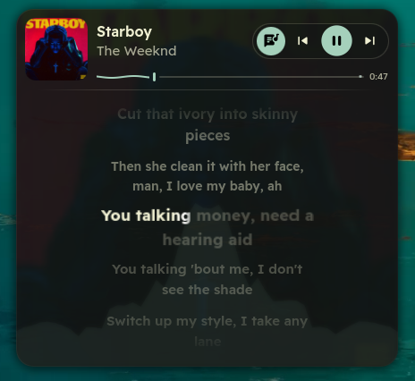

# Quickshell Music Player

A modern, animated MPRIS media player widget for Quickshell featuring real-time synchronized lyrics with nine lyric themes (including Reel, a kinetic lyric-video mode), album art morphing transitions, spring-physics micro-animations, adaptive Material 3 color harmonizing, and interactive progress scrub seeking.



## Features

- Synchronized Scrolling Lyrics: Real-time synchronized lyrics with 60 FPS interpolation, interactive click-to-seek, and smooth auto-scrolling.
- Word-Timed Lyrics from Three Sources: Lyrics are requested from AMLL (word-by-word timing, matched by Spotify track ID), LRCLIB and NetEase at once, and the best available answer wins. When LRCLIB holds several uploads of a song with different timings, the one most uploads agree on is used, so a single mistimed upload can't put the lyrics out of sync.
- Lyric Themes: Theme, Cinematic, Neon, Editorial, Nocturne, Neon script, Edit, Motion and Reel, each with its own typefaces, colours, glow and stage effects. Double-click the lyrics button to move to the next theme; a single click opens and closes the lyrics.
- Reel (Kinetic Lyric Video): Lyrics play like a lyric edit. Twenty-seven looks, each with its own typeface, colour and motion: letters land on the vocal (slam, cascade, scatter, typed-on, focus pull, card flip, squash-and-stretch, scramble-decode, strobe, orbit, pendulum swing and more), a highlight sweeps through each word at the speed it is sung, whole lines cut in (wipe, iris, push, zoom, tilt, drop) and leave on a cut (fly-through, blur, glitch, shatter, whip pan, melt, implode, dissolve and more). The stage moves like a camera, with a slow push-in and a punch on every hit, and follow-cam looks pan from word to word. Looks rotate in a shuffled order per song.
- Beat Reaction: With `cava` installed, Reel listens to the music too. Each kick drum punches the camera, bounces the word being sung and pulses the glow behind the line.
- Player Volume: The volume control adjusts the player's own audio stream through PipeWire, not the whole system.
- Morphing Album Art: Fluid animated transitions between compact media bar and expanded lyrics sheet without image flicker.
- Adaptive Theming: Extracts the dominant palette from the currently playing album art to dynamically tint the card background, borders, and accent controls.
- Tactile Micro-Animations: Spring scale curves (Easing.OutBack) on playback buttons, lyric lines, and toggle triggers.
- Interactive Progress Bar: Accurate track progress interpolation, click-to-seek support with D-Bus grace windows, and instant reset on track replay.
- Browser & Video Suppression: Automatically detects browser and video media streams to prevent unwarranted lyric fetching.
- Multiple Player Presets:
  - ExpandingLyricsPlayer: Flagship morphing card with lyrics panel toggle.
  - CompactPlayer: Minimal horizontal bar with track info and basic controls.
  - ClassicPlayer: Full-featured traditional layout with volume and timeline.
  - MinimalPlayer: Lightweight low-profile widget for compact desktop setups.
  - VisualizerPlayer: Waveform and audio visualizer embedded into the player card.
  - AlbumArtPlayer: Large artwork focus with overlaid track details.
  - LyricsPlayer / LyricsSplitPlayer: Dedicated dual-column and standalone lyrics viewers.
  - FullPlayer: Comprehensive media dashboard with expanded metrics.
- Universal MPRIS Support: Works out of the box with Spotify, MPV, Firefox, Chrome, Brave, Amberol, Cider, and any MPRIS2-compliant player.

## Requirements

- Quickshell (0.3.0 or later)
- Qt 6 (qt6-declarative, qt6-5compat, qt6-svg)
- playerctl (for MPRIS media control and position tracking)
- Python 3 (standard library only; used by lyrics fetcher)
- cava (optional, for Reel's beat reaction)
- Material Symbols or Nerd Font (for media icons)

The lyric themes bundle their display fonts in `assets/fonts/lyrics/` (all under the SIL Open Font License; licence files sit next to the fonts).

## Installation

Clone the repository:

```bash
git clone https://github.com/ZonicExists/quickshell-music-player.git
cd quickshell-music-player
```

## Usage

### Standalone Window

You can launch the widget directly with Quickshell:

```bash
quickshell -p shell.qml
```

### Integration into an Existing Quickshell Configuration

Copy the module directories (`components/`, `presets/`, `services/`, `scripts/`, `common/`) into your Quickshell configuration:

```qml
import QtQuick
import Quickshell
import Quickshell.Services.Mpris
import "presets"
import "services"

Item {
    width: 420
    height: player.lyricsExpanded ? 380 : 144

    ExpandingLyricsPlayer {
        id: player
        anchors.fill: parent
        player: MprisController.activePlayer
    }
}
```

## Directory Structure

```
quickshell-music-player/
├── assets/
│   ├── preview.png               # Widget preview screenshot
│   └── fonts/lyrics/             # Display fonts used by the lyric themes
├── components/
│   ├── PlayerArtwork.qml         # Album cover container with fallback
│   ├── PlayerBase.qml            # Core player state, art resolution, and seek logic
│   ├── PlayerControls.qml        # Play/pause, next, prev, and lyric buttons
│   ├── PlayerInfo.qml            # Title, artist, and album typography
│   ├── PlayerLyrics.qml          # Synced lyrics renderer and scroll engine
│   ├── KineticLyrics.qml         # Reel / Edit / Motion kinetic lyric view
│   ├── lyricsProfiles.js         # Lyric themes and Reel looks
│   ├── PlayerProgress.qml        # Interactive timeline slider
│   └── qmldir
├── presets/
│   ├── ExpandingLyricsPlayer.qml # Morphing lyrics player
│   ├── CompactPlayer.qml         # Compact bar
│   ├── MinimalPlayer.qml         # Minimal layout
│   ├── ClassicPlayer.qml         # Classic media box
│   ├── VisualizerPlayer.qml      # Visualizer integration
│   ├── AlbumArtPlayer.qml        # Artwork focused
│   ├── LyricsPlayer.qml          # Full lyrics card
│   ├── LyricsSplitPlayer.qml     # Side-by-side lyrics layout
│   ├── FullPlayer.qml            # Full media dashboard
│   └── qmldir
├── services/
│   ├── LyricsService.qml         # High-precision lyrics synchronizer
│   ├── MprisController.qml       # Active player manager and tracker
│   ├── YtMusic.qml               # Optional player bridge
│   └── qmldir
├── scripts/
│   └── lyrics/
│       └── lyrics.py             # AMLL, LRCLIB and NetEase lyrics fetcher
├── common/
│   ├── Appearance.qml            # Design tokens, motion curves, and palette
│   ├── ColorUtils.qml            # Color manipulation utilities
│   ├── Config.qml                # Options and fallback settings
│   ├── MaterialSymbol.qml        # Icon rendering component
│   ├── RippleButton.qml          # Tactile animated button
│   ├── StyledSlider.qml          # Custom slider control
│   ├── StyledText.qml            # Text renderer with formatting
│   ├── StyledImage.qml           # Cached image loader
│   ├── StyledRectangularShadow.qml # Drop shadow effect
│   ├── AdaptedMaterialScheme.qml # Dynamic color scheme adapter
│   ├── MediaArtworkResolver.qml  # Cover art cache and resolver
│   ├── CavaProcess.qml           # Audio spectrum from cava, for beat reaction
│   └── qmldir
├── shell.qml                     # Standalone launcher
├── LICENSE                       # MIT License
└── README.md
```

## Configuration

The player appearance and animation metrics can be adjusted in `common/Appearance.qml`:

- `fontSizeScale`: Global typography scaling factor.
- `animationsEnabled`: Toggle all UI transitions and micro-animations.
- `rounding`: Corner radius scales for card frames and album covers.
- `colors`: Base fallback palette when album art color extraction is unavailable.

The default lyric theme is set in `common/Config.qml` (`media.lyricsStyle`, for example `"reel"` or `"default"`). Reel's options sit next to it:

- `reelCamera`: `"off"`, `"subtle"`, `"normal"` or `"strong"` camera movement.
- `reelBeats`: `"off"`, `"light"` or `"strong"` reaction to the beat (needs `cava`).
- `reelTransitions`: `"look"` for each look's own transitions, or `"mixed"` to vary them every line.
- `reelLookChange`: how many lines a look lasts; `0` changes it only at pauses between sections.
- `reelDisabledLooks`: look ids to leave out of the rotation, for example `["follow", "comic"]`.

New themes and Reel looks are added in `components/lyricsProfiles.js`; the file documents every field.

## License

This project is licensed under the MIT License. See the [LICENSE](LICENSE) file for details.
