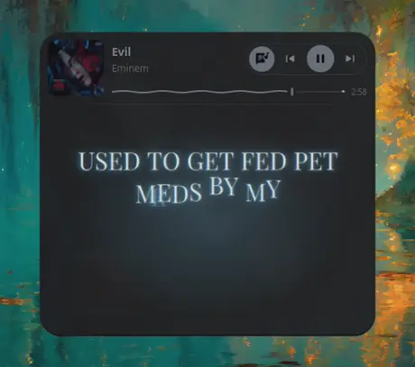

# Quickshell Music Player

An animated MPRIS music player for Quickshell with synced lyrics, nine lyric themes and Reel, a lyric-video mode where every line is typeset and animated like a music edit.

[](assets/preview.mp4)

*Reel lyrics on a live track. Click for the full-quality video.*

## What it does

**Lyrics that keep time.** Lyrics are fetched from three sources at once: AMLL (word-by-word timing, matched by Spotify track ID), LRCLIB and NetEase. The best answer wins. When LRCLIB holds several uploads of a song with different timings, the timing most of them agree on is used, so one mistimed upload can't put the lyrics out of sync. Click any line to seek to it.

**Nine lyric themes.** Theme, Cinematic, Neon, Editorial, Nocturne, Neon script, Edit, Motion and Reel, each with its own typefaces, colours, glow and stage effects. Double-click the lyrics button to move to the next theme; a single click opens and closes the lyrics.

**Reel.** Lyrics play like a lyric edit, in 27 looks that rotate through each song in a shuffled order:

- Letters land on the vocal: slammed down, cascading, scattered in, typed on, pulled into focus, flipped like cards, decoded from scrambled characters, strobing on, orbiting in, swinging down from their tops and more.
- A highlight sweeps through each word at the speed it is sung.
- Whole lines cut in (wipe, iris, push, zoom, tilt, drop) and leave on a cut (fly-through, blur, glitch, shatter, whip pan, melt, implode, dissolve and more).
- The stage moves like a camera: a slow push-in across each line and a punch on every hit. Follow-cam looks set the line wider than the frame and pan from word to word.
- With `cava` installed, Reel reacts to the beat: each kick punches the camera, bounces the word being sung and pulses the glow behind the line.

**A player that adapts.** The card takes its colours from the album art, morphs smoothly between the compact bar and the lyrics sheet, and its volume control adjusts the player's own audio stream rather than the whole system.

**Any MPRIS player.** Spotify, MPV, Firefox, Chrome, Brave, Amberol, Cider and anything else that speaks MPRIS2. Browser and video streams are recognised, so the player doesn't go looking for lyrics to a YouTube tutorial.

## Player layouts

| Preset | Layout |
|---|---|
| `ExpandingLyricsPlayer` | Compact card that expands into the lyrics sheet (the one in the video) |
| `CompactPlayer` | Horizontal bar with track info and controls |
| `MinimalPlayer` | Low-profile widget for tight setups |
| `ClassicPlayer` | Traditional layout with volume and timeline |
| `VisualizerPlayer` | Audio visualizer built into the card |
| `AlbumArtPlayer` | Large artwork with track details over it |
| `LyricsPlayer` | Card given over to the lyrics |
| `LyricsSplitPlayer` | Artwork and controls beside the lyrics |
| `FullPlayer` | Everything at once |

## Requirements

- Quickshell 0.3.0 or later
- Qt 6 (`qt6-declarative`, `qt6-5compat`, `qt6-svg`)
- `playerctl`
- Python 3 (standard library only, for the lyrics fetcher)
- Material Symbols font, for the icons
- `cava` (optional, for Reel's beat reaction)

The display fonts the lyric themes use are bundled in `assets/fonts/lyrics/`, each with its licence file (SIL Open Font License, or Apache 2.0 for Permanent Marker).

## Install and run

```bash
git clone https://github.com/zonicisalive/quickshell-music-player.git
cd quickshell-music-player
qs -p .
```

The player opens in the top-right corner of the screen and follows whichever player is active.

### Using it in your own Quickshell config

Copy `components/`, `presets/`, `services/`, `scripts/`, `common/` and `assets/` into your config, then:

```qml
import QtQuick
import Quickshell
import "presets"
import "services"

Item {
    width: 420
    height: player.lyricsExpanded ? 380 : 144

    ExpandingLyricsPlayer {
        id: player
        anchors.fill: parent
        player: MprisController.activePlayer
    }
}
```

## Configuration

Settings live in `common/Config.qml`, under `media`:

| Option | Values | What it changes |
|---|---|---|
| `lyricsStyle` | `"reel"`, `"default"`, `"cinematic"`, `"neon"`, `"editorial"`, `"nocturne"`, `"neonScript"`, `"kinetic"`, `"motion"` | Lyric theme at start (the lyrics button cycles them) |
| `reelCamera` | `"off"`, `"subtle"`, `"normal"`, `"strong"` | How much the Reel camera pushes and punches |
| `reelBeats` | `"off"`, `"light"`, `"strong"` | How hard Reel reacts to the beat |
| `reelTransitions` | `"look"`, `"mixed"` | Each look's own transitions, or a different entrance and exit every line |
| `reelLookChange` | a number of lines, or `0` | How long a look lasts; `0` changes it only at pauses between sections |
| `reelDisabledLooks` | list of look ids | Looks left out of the rotation, for example `["follow", "comic"]` |

Look ids, and everything else a look is made of, are in `components/lyricsProfiles.js`. The file documents every field, so a new theme or Reel look only needs an entry there.

Colours, rounding, type sizes and animation speed are set in `common/Appearance.qml`:

- `fontSizeScale` scales all text.
- `animationsEnabled` turns every transition off.
- `colors` is the fallback palette for when there's no album art to take colours from.

## Project layout

```
quickshell-music-player/
├── shell.qml                  Standalone launcher
├── presets/                   The nine player layouts
├── components/
│   ├── PlayerBase.qml         Player state, artwork and seeking
│   ├── PlayerLyrics.qml       Synced lyric sheet and the lyric themes
│   ├── KineticLyrics.qml      Reel, Edit and Motion lyric views
│   ├── lyricsProfiles.js      Lyric themes and Reel looks
│   └── ...                    Artwork, info, controls, progress
├── services/
│   ├── LyricsService.qml      Lyrics lookup and timing
│   └── MprisController.qml    Active player and stream volume
├── scripts/lyrics/lyrics.py   AMLL, LRCLIB and NetEase fetcher
├── common/                    Theme tokens, shared widgets, settings, cava
└── assets/                    Preview video and lyric fonts
```

## License

MIT. See [LICENSE](LICENSE). Bundled fonts keep their own licences, next to each font in `assets/fonts/lyrics/`.
